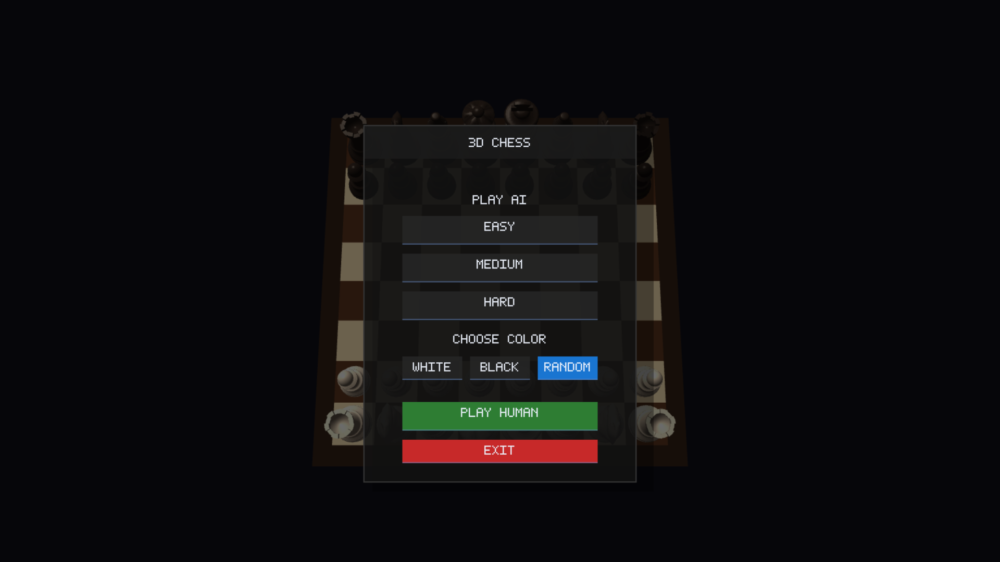
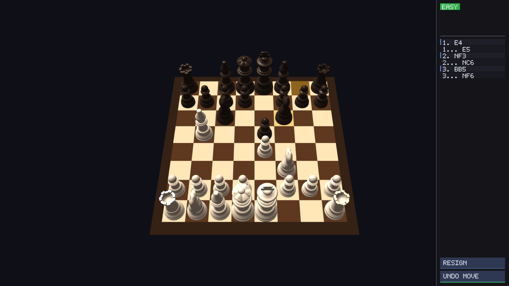

# 3D Chess

3D Chess is a C++ chess application with an OpenGL-rendered board, interactive 3D pieces, complete move validation, and optional human-like AI play through Leela Chess Zero and Maia.

The app supports both human-vs-human and human-vs-AI games. If the optional AI files are not installed, 3D Chess still runs normally for local play.

## Preview





## Features

- Real-time 3D board and chess piece rendering with OpenGL
- SDL2-based fullscreen windowing, input, and event handling
- Legal move generation and validation
- Check, checkmate, stalemate, and 50-move draw handling
- Human-vs-human and human-vs-AI game modes
- AI difficulty presets backed by a UCI engine
- Promotion, undo, resign, new game, and back-to-menu controls
- Captured-piece tracking and move history support
- Orbit, zoom, and reset camera controls
- Local shader and OBJ model asset pipeline

## Tech Stack

- C++17
- CMake
- SDL2
- OpenGL
- GLAD
- GLM
- tinyobjloader
- Optional: Leela Chess Zero (`lc0`) with Maia neural network weights

## Project Structure

```text
assets/
  models/        OBJ models for the chess pieces
  shaders/       GLSL shaders for the board, pieces, and highlights

lib/
  glad/          OpenGL function loader
  tinyobj/       OBJ model loader

src/
  ai/            UCI engine bridge and AI difficulty configuration
  core/          Board state, move validation, game flow, history, and captures
  input/         Mouse input, board picking, and interaction handling
  renderer/      OpenGL renderer, 3D board, piece meshes, highlights, and UI
  main.cpp       Application startup, event loop, and game wiring
```

## Requirements

- CMake 3.16 or newer
- A C++17-compatible compiler
- SDL2 development libraries
- OpenGL
- GLM headers

On Windows, make sure SDL2 and GLM are available to CMake. GLM can also be placed in `lib/glm`, which is checked by `CMakeLists.txt`.

## Build

From the project root:

```powershell
cmake -S . -B build
cmake --build build
```

The compiled executable is created at:

```text
build/bin/3DChess.exe
```

Runtime assets are copied automatically to:

```text
build/bin/assets/
```

## Run

After building, run:

```powershell
.\build\bin\3DChess.exe
```

## Optional AI Setup

3D Chess can use Leela Chess Zero as the UCI engine and Maia as the neural network weights file. These files are intentionally not committed to the repository because they are external runtime dependencies and can be large.

Download:

- `lc0.exe`: get a Windows build from the official Leela Chess Zero releases page: <https://github.com/LeelaChessZero/lc0/releases>
- `maia-1100.pb.gz`: get the Maia 1100 weights from the Maia Chess repository: <https://github.com/CSSLab/maia-chess>

Place both files beside the built executable:

```text
build/bin/
  3DChess.exe
  lc0.exe
  maia-1100.pb.gz
```

When these files are present, AI mode can launch lc0 and load the Maia weights. When they are missing, the application logs that lc0 is unavailable and continues without AI.

## Controls

- Left click: select pieces, make moves, and press UI controls
- Right drag: orbit the camera
- Mouse wheel: zoom in and out
- `R`: reset the camera
- `Esc`: quit

## License

This project is licensed under the MIT License. See [LICENSE](LICENSE) for details.
